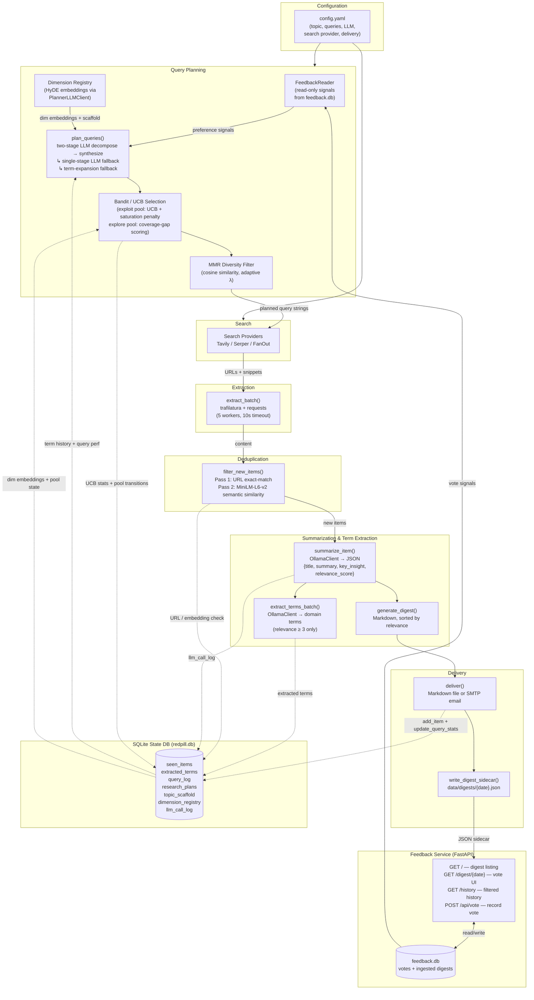

%% redpill — end-to-end architecture

```mermaid
flowchart TD
    subgraph CONFIG["Configuration"]
        cfg["config.yaml<br/>(topic, queries, LLM,<br/>search provider, delivery)"]
    end

    subgraph PLANNER["Query Planning"]
        direction TB
        fb_reader["FeedbackReader<br/>(read-only signals<br/>from feedback.db)"]
        registry["Dimension Registry<br/>(HyDE embeddings via<br/>PlannerLLMClient)"]
        bandit["Bandit / UCB Selection<br/>(exploit pool: UCB + saturation penalty<br/>explore pool: coverage-gap scoring)"]
        mmr["MMR Diversity Filter<br/>(cosine similarity, adaptive λ)"]
        qp["plan_queries()<br/>two-stage LLM decompose → synthesize<br/>↳ single-stage LLM fallback<br/>↳ term-expansion fallback"]

        fb_reader -->|preference signals| qp
        registry -->|dim embeddings + scaffold| qp
        qp --> bandit
        bandit --> mmr
    end

    subgraph SEARCH["Search"]
        providers["Search Providers<br/>Tavily / Serper / FanOut"]
    end

    subgraph EXTRACT["Extraction"]
        extract["extract_batch()<br/>trafilatura + requests<br/>(5 workers, 10s timeout)"]
    end

    subgraph DEDUP["Deduplication"]
        dedup["filter_new_items()<br/>Pass 1: URL exact-match<br/>Pass 2: MiniLM-L6-v2 semantic similarity"]
    end

    subgraph SUMMARIZE["Summarization & Term Extraction"]
        llm_sum["summarize_item()<br/>OllamaClient → JSON<br/>{title, summary, key_insight,<br/>relevance_score}"]
        term_ex["extract_terms_batch()<br/>OllamaClient → domain terms<br/>(relevance ≥ 3 only)"]
        digest["generate_digest()<br/>Markdown, sorted by relevance"]
    end

    subgraph DELIVER["Delivery"]
        deliver["deliver()<br/>Markdown file or SMTP email"]
        sidecar["write_digest_sidecar()<br/>data/digests/{date}.json"]
    end

    subgraph STATE["SQLite State DB (redpill.db)"]
        db[("seen_items<br/>extracted_terms<br/>query_log<br/>research_plans<br/>topic_scaffold<br/>dimension_registry<br/>llm_call_log")]
    end

    subgraph FEEDBACK["Feedback Service (FastAPI)"]
        fapi["GET / — digest listing<br/>GET /digest/{date} — vote UI<br/>GET /history — filtered history<br/>POST /api/vote — record vote"]
        fdb[("feedback.db<br/>votes + ingested digests")]
    end

    %% Main Execution Pipeline (Solid Lines)
    cfg --> PLANNER
    cfg --> SEARCH
    mmr -->|planned query strings| providers
    providers -->|URLs + snippets| extract
    extract -->|content| dedup
    dedup -->|new items| llm_sum
    llm_sum --> term_ex
    llm_sum --> digest
    digest --> deliver
    deliver --> sidecar
    sidecar -->|JSON sidecar| fapi
    fapi <-->|read/write| fdb
    fdb -->|vote signals| fb_reader

    %% State & Database Interactions (Dashed Lines)
    term_ex -.->|extracted terms| db
    dedup -.->|URL / embedding check| db
    llm_sum -.->|llm_call_log| db
    bandit -.->|UCB stats + pool transitions| db
    deliver -.->|add_item + update_query_stats| db
    db -.->|term history + query perf| qp
    db -.->|dim embeddings + pool state| bandit
```
